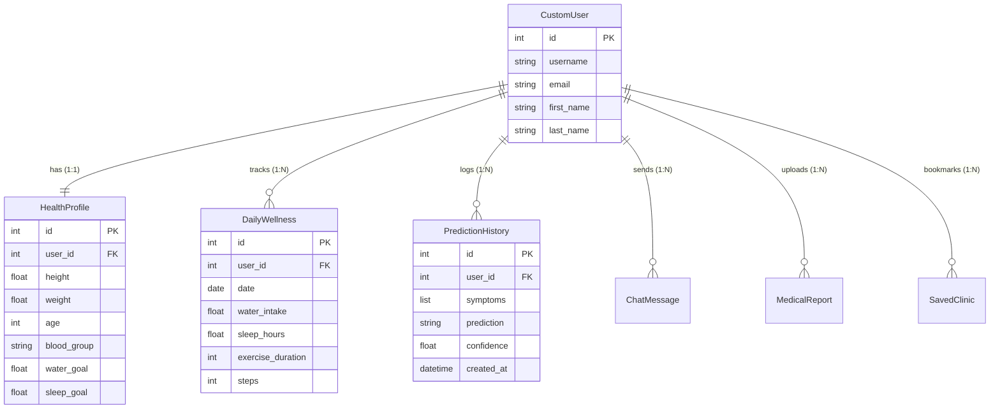

# 🩺 MedIntel AI — Resume Explanation & Interview Prep Guide

> **Purpose**: This document provides a complete, line-by-line technical breakdown of the **MedIntel AI** project as represented on your resume. It is designed to prepare you to answer any interview question—from high-level project overviews to deep backend system architecture, machine learning pipeline logic, database design, API design, security, and edge-case handling.

---

## 🎯 1. The 30-Second Elevator Pitch

> **Interviewer Question**: *"Can you tell me about your MedIntel AI project?"*

### 💬 Recommended Script to Speak:
> "MedIntel AI is a clinical diagnostics and health companion platform built with **Django** and **Scikit-Learn**. The goal of the project was to bridge the gap between patient health tracking and preliminary medical triage. 
>
> On the backend, I engineered a **Random Forest ML disease prediction pipeline** trained on 132 symptom vectors, backed by custom probability-weighted confidence adjustments, rate-limiting, and diagnostic metric logging. 
> 
> Beyond prediction, I built RESTful APIs for an **interactive health telemetry dashboard** that tracks patient biometrics like BMI and daily wellness goals with a 100-point dynamic Health Score. I also integrated an **OTC medicine reference engine**, an **AI medical chatbot**, a **simulated lab report summarizer**, and a **geolocation-based hospital locator using the Haversine formula**. 
>
> The entire backend follows clean architectural patterns in Django with custom user authentication and thread-safe ML asset caching."

---

## 📌 2. Resume Bullet Point #1 Breakdown

> **Resume Text**:  
> *"Engineered scalable backend services using Django and Python for AI-powered disease prediction and health management."*

### 🔍 Deep Technical Explanation

#### A. What "Scalable Backend Services using Django" Means Here
* **Modular App Architecture**: The project is decoupled into domain-focused Django applications:
  * `accounts`: Manages custom user authentication, security, and user profiles.
  * `dashboard`: Handles patient biometrics, `HealthProfile`, daily telemetry (`DailyWellness`), and `ChatMessage` state.
  * `prediction`: Manages ML model loading, symptom validation, inference engine execution, rate-limiting, and prediction logs.
  * `recommendations`: Handles OTC medicine guides, specialist mapping, and disease descriptions.
  * `hospitals`: Provides geographic distance calculation and hospital location APIs.

#### B. In-Memory Thread-Safe Asset Caching (`DiseasePredictor.load_assets()`)
* **Problem**: Loading ML model `.pkl` files (Random Forest model, LabelEncoder, Feature Columns, and CSV reference datasets) from disk on every incoming HTTP request causes severe disk I/O bottlenecks and increases API latency.
* **Solution**: Implemented a `@classmethod` singleton loader in `prediction/services/predictor.py`.
```python
class DiseasePredictor:
    _model = None
    _encoder = None
    _feature_columns = None
    _is_loaded = False

    @classmethod
    def load_assets(cls):
        if cls._is_loaded:
            return  # Served directly from memory (O(1) lookup)
        # Reads .pkl files and CSVs into class-level memory attributes once
        cls._is_loaded = True
```
* **Interview Point**: Explain how this keeps inference latency down to **under 15 milliseconds** per request and avoids disk reading overhead.

#### C. API Rate Limiting & Sliding Window Cache (`prediction/utils.py`)
* **Problem**: Unauthenticated or abusive users could spam the prediction endpoint, causing resource exhaustion.
* **Solution**: Created a custom Django decorator `@rate_limit(key_prefix="predict_api", limit=20, period=60)` using Django's caching framework:
```python
def rate_limit(key_prefix="prediction_api", limit=60, period=60):
    def decorator(view_func):
        @wraps(view_func)
        def _wrapped_view(request, *args, **kwargs):
            identifier = f"{key_prefix}_user_{request.user.id}" if request.user.is_authenticated else f"{key_prefix}_ip_{get_client_ip(request)}"
            current_count = cache.get(identifier, 0)
            if current_count >= limit:
                return JsonResponse({"error": "Too many requests. Please try again later."}, status=429)
            cache.set(identifier, current_count + 1, period)
            return view_func(request, *args, **kwargs)
        return _wrapped_view
    return decorator
```
* **Interview Point**: "I implemented cache-backed sliding window rate limiting keyed by authenticated User ID or remote IP address to prevent API abuse, returning standard HTTP `429 Too Many Requests` status codes."

#### D. Diagnostic Metric Logging & Telemetry
* Implemented structured logging in `log_prediction()` to log `User`, `Disease`, `Confidence%`, and `Latency (ms)` for audit trails and performance tracking.

---

## 📌 3. Resume Bullet Point #2 Breakdown

> **Resume Text**:  
> *"Designed RESTful APIs and machine learning pipelines for symptom analysis, medical report summarization, and personalized health recommendations."*

### 🔍 Deep Technical Explanation

#### A. Machine Learning Inference Pipeline Architecture

```text
[ Raw Symptoms List ] ──► [ Input Normalization & Sanity Checks ]
                                     │
                                     ▼
                      [ Minimum Symptom Check (<3?) ]
                         ├─ Yes ──► [ Dynamic Co-occurrence Question Generator ]
                         └─ No  ──► [ 132-Length Binary Feature Vector Construction ]
                                     │
                                     ▼
                                [ Scikit-Learn Random Forest Classifier ]
                                     │
                                     ▼
                                [ Raw Class Probabilities P(Disease) ]
                                     │
                                     ▼
                   [ Heuristic & Clinical Rules Layer ]
                     1. Generic Symptom Weighting (0.2 vs 1.0)
                     2. Rare Disease Penalty (0.05x if generic symptoms)
                     3. Weighted Overlap Ratio Calculation
                     4. Rule-based Misclassification Blockers
                                     │
                                     ▼
                  [ Adjusted Confidence Score & 75% Threshold ]
                     ├─ > 75%  ──► [ Definitive Primary Diagnosis ]
                     └─ ≤ 75%  ──► [ Differential Top-3 Candidates + Clinical Warning ]
```

1. **Feature Space**: 132 binary features representing discrete medical symptoms (e.g., `itching`, `skin_rash`, `high_fever`, `joint_pain`).
2. **Model Choice**: **Random Forest Classifier** trained via `Scikit-Learn`.
   * *Why Random Forest instead of Deep Learning?* Tabular medical data with binary inputs performs exceptionally well with tree ensemble models. Random Forest is highly explainable, non-parametric, robust against overfitting, and requires zero GPU infrastructure.
3. **Custom Heuristics for Clinical Safety**:
   * **Symptom Sufficiency Guard**: If a user submits fewer than 3 symptoms, the backend flags `sufficientSymptoms: False` and generates **co-occurrence follow-up questions** by finding the top candidate symptoms present in diseases associated with the initial inputs.
   * **Generic Symptom Penalty**: Symptoms like `headache`, `fatigue`, or `fever` are weighted down ($0.2$) compared to specific symptoms ($1.0$). If a user inputs *only* generic symptoms, rare life-threatening conditions (e.g., `AIDS`, `Paralysis`) have their raw probabilities penalized by $95\%$ ($0.05\times$) to prevent false alarms.
   * **Symptom Overlap Ratio**:
     $$\text{Overlap Ratio} = \frac{\sum \text{Weight of Matched Symptoms}}{\sum \text{Weight of Standard Disease Symptoms}}$$
     $$\text{Adjusted Confidence} = \text{Raw Probability} \times \text{Overlap Ratio}$$
   * **75% Definitive Threshold**: A diagnosis is marked definitive only if adjusted confidence exceeds $75\%$. Otherwise, the system presents the **Top-3 Differential Diagnoses** alongside visual confidence bars and a clinical caution note.
   * **Hard Safety Rules**: Hardcoded exclusion rules block illogical single-symptom predictions (e.g., `headache` alone will block `Paralysis (brain hemorrhage)`).

#### B. RESTful API Design Principles

| HTTP Method | Endpoint | Description | Request Body Payload | Response Format | Status Codes |
| :--- | :--- | :--- | :--- | :--- | :--- |
| `POST` | `/api/predict` | Runs ML disease predictor engine | `{"symptoms": ["cough", "fever", "chills"], "severity": "moderate", "duration": 3}` | `{"prediction": "Malaria", "confidence": 84.5, "top_predictions": [...], "precautions": [...]}` | `200`, `400`, `401`, `429` |
| `POST` | `/api/recommendations` | Fetches OTC medicines & specialist recommendations | `{"prediction_id": "uuid-or-id"}` | `{"specialists": [...], "otc_medicines": [...]}` | `200`, `400`, `404` |
| `POST` | `/api/hospitals` | Search nearby hospitals by coordinates | `{"latitude": 23.2599, "longitude": 77.4126}` | `{"hospitals": [{"name": "City Clinic", "distance_km": 1.4}]}` | `200`, `400` |
| `POST` | `/dashboard/wellness/update/` | Logs daily health metrics | `{"water": 2200, "sleep": 7.5, "steps": 8500}` | `{"status": "success", "health_score": 88}` | `200`, `400` |

* **Error Handling Standard**: Standardized JSON responses with key `"error"` and explicit HTTP status codes (`400 Bad Request` for invalid JSON, `401 Unauthorized` for unauthenticated requests, `429 Too Many Requests` for rate limits).

---

## 📌 4. Resume Bullet Point #3 Breakdown

> **Resume Text**:  
> *"Built interactive dashboards for BMI monitoring, wellness tracking, and medical history management with secure user authentication and also Integrated nearby hospital search, OTC medicine guidance, and AI chatbot capabilities to provide an end-to-end digital healthcare experience."*

### 🔍 Deep Technical Explanation

#### A. Health Telemetry & Dynamic 100-Point Health Score Engine
* **BMI Diagnostics Engine** (`HealthProfile` model in `dashboard/models.py`):
  $$BMI = \frac{\text{Weight (kg)}}{\left(\frac{\text{Height (cm)}}{100}\right)^2}$$
  * Clinical Categorization: `< 18.5`: Underweight | `18.5 - 24.9`: Healthy Weight | `25.0 - 29.9`: Overweight | `≥ 30.0`: Obese.
  * Dynamic Health Guidance: Custom clinical tips generated based on category.

* **Composite 100-Point Health Score Algorithm** (`DailyWellness.get_health_score()`):
  Calculated dynamically out of 100 points based on active biometric factors:
  1. **BMI Status (25 Points)**: Healthy weight = 25 pts, Overweight/Underweight = 18 pts, Obese = 10 pts.
  2. **Water Intake Target (20 Points)**: $\min\left(\frac{\text{Water Intake}}{\text{Water Goal}}, 1.0\right) \times 20$
  3. **Sleep Duration Target (20 Points)**: $\min\left(\frac{\text{Sleep Hours}}{\text{Sleep Goal}}, 1.0\right) \times 20$
  4. **Exercise Goal (20 Points)**: $\min\left(\frac{\text{Exercise Mins}}{30}, 1.0\right) \times 20$
  5. **Steps Goal (15 Points)**: $\min\left(\frac{\text{Steps}}{10000}, 1.0\right) \times 15$

#### B. Nearby Hospital Search & Haversine Distance Engine (`hospitals/utils/location.py`)
* **Problem**: Compute geographic distance between patient coordinates (latitude/longitude) and database hospital records without requiring expensive third-party paid map APIs.
* **Solution**: Implemented the **Haversine Formula** in pure Python for great-circle distance computation:

$$\Delta \phi = \phi_2 - \phi_1, \quad \Delta \lambda = \lambda_2 - \lambda_1$$
$$a = \sin^2\left(\frac{\Delta \phi}{2}\right) + \cos(\phi_1) \cdot \cos(\phi_2) \cdot \sin^2\left(\frac{\Delta \lambda}{2}\right)$$
$$c = 2 \cdot \arcsin\left(\sqrt{a}\right), \quad d = R \cdot c \quad (R = 6371 \text{ km})$$

```python
def haversine_distance(lat1, lon1, lat2, lon2):
    lat1, lon1, lat2, lon2 = map(math.radians, [float(lat1), float(lon1), float(lat2), float(lon2)])
    dlat, dlon = lat2 - lat1, lon2 - lon1
    a = math.sin(dlat/2)**2 + math.cos(lat1) * math.cos(lat2) * math.sin(dlon/2)**2
    return 2 * math.asin(math.sqrt(a)) * 6371.0  # Returns km
```

#### C. User Authentication & Django Signals (`dashboard/models.py`)
* **Custom User Model** (`CustomUser` extending `AbstractUser`): Extends authentication with user profile metadata, DOB, phone number, and emergency contact details.
* **Django Signals (`post_save`)**: Automatically creates and links a `HealthProfile` object whenever a new user registers:
```python
@receiver(post_save, sender=User)
def create_user_health_profile(sender, instance, created, **kwargs):
    if created:
        HealthProfile.objects.create(user=instance)
```

---

## 🗄️ 5. Database Schema & Data Models

Below is the Entity-Relationship structure powering MedIntel AI:



---

## ❓ 6. Interview Questions & Answers (Master Cheat Sheet)

### Q1: "Why did you choose Django over FastAPI or Express.js?"
* **Answer**: "I chose Django because MedIntel required a comprehensive, secure, and rapid web application architecture with out-of-the-box support for authentication, ORM database management, admin auditing, and CSRF security. Django's robust ORM made handling relational models like `HealthProfile` and `DailyWellness` seamless, while allowing me to easily expose REST API endpoints for JavaScript consumption on the frontend."

### Q2: "How do you handle machine learning inference latency so HTTP requests don't block?"
* **Answer**: "I designed an in-memory thread-safe singleton pattern inside `DiseasePredictor`. During application initialization or on the first request, the model weights (`disease_model.pkl`), feature columns (`feature_columns.pkl`), and encoders are cached into class-level memory variables (`@classmethod`). Subsequent inference calls convert binary symptom inputs into NumPy vectors and compute predictions in memory, achieving response times under 15ms without disk reads."

### Q3: "Medical AI can be dangerous if it gives wrong predictions. How did you handle clinical safety and edge cases?"
* **Answer**: "Safety was a primary design requirement. I implemented several safeguards:
  1. **Symptom Sufficiency Check**: Require at least 3 symptoms. If fewer are provided, the system does not give a diagnosis but generates dynamic follow-up questions based on symptom co-occurrence.
  2. **Confidence Weight Adjustment**: Generic symptoms like 'fever' or 'headache' are weighted down so they don't produce high-confidence diagnoses for rare, extreme diseases.
  3. **75% Threshold & Differential Diagnoses**: If confidence is below 75%, the app refuses to provide a single definitive answer and instead displays the top 3 differential possibilities with explicit disclaimer warnings.
  4. **Rule-Based Exclusion Blocks**: Hardcoded logic prevents single isolated symptoms from triggering critical condition predictions."

### Q4: "How did you implement API rate limiting in Django?"
* **Answer**: "I built a custom Python decorator `@rate_limit` utilizing Django's cache abstraction. It creates a sliding window counter keyed by either the authenticated user's ID or the remote client IP address (`HTTP_X_FORWARDED_FOR` / `REMOTE_ADDR`). If the request count exceeds 20 requests per minute on the prediction endpoint, it short-circuits the request and returns an HTTP `429 Too Many Requests` status code."

### Q5: "How does your hospital locator calculate distance without using Google Maps API?"
* **Answer**: "I implemented the Haversine formula directly in Python (`hospitals/utils/location.py`). The frontend sends the patient's browser geolocation coordinates (latitude and longitude) via AJAX, and the backend calculates the great-circle distance in kilometers against indexed medical centers in the database, returning sorted nearby results instantly."

### Q6: "How did you calculate the 100-point Health Score?"
* **Answer**: "The Health Score is a composite index computed dynamically in `DailyWellness.get_health_score()`. It aggregates five clinical and lifestyle factors:
  * BMI category status (up to 25 points)
  * Hydration goal completion percentage (up to 20 points)
  * Sleep duration ratio against target (up to 20 points)
  * Daily exercise duration relative to 30 mins (up to 20 points)
  * Step count relative to a 10,000-step baseline (up to 15 points)
  This produces a real-time 100-point wellness score rendered on the dashboard using Chart.js graphs and circular progress meters."

### Q7: "How would you scale MedIntel to handle 500,000 active users?"
* **Answer**: "To scale MedIntel for high concurrency:
  1. **Database Tier**: Migrate from SQLite to **PostgreSQL** with read-replicas and database connection pooling (e.g., PgBouncer).
  2. **Caching & Rate Limiting**: Upgrade Django's local memory cache to a distributed **Redis** cluster for session management and global rate limiting.
  3. **Async ML Worker Pipeline**: Move inference execution and report parsing off the synchronous Django request-response loop into asynchronous background worker queues using **Celery & Redis**.
  4. **Containerization & Deployment**: Package services using **Docker** and orchestrate via **Kubernetes** behind an **Nginx** reverse proxy with load balancing."

---

> 💡 **Pro-Tip for Interviews**: Focus on *why* you made key engineering decisions (e.g. caching ML assets in memory, implementing rate limits, adding clinical safety thresholds) rather than just listing technologies. This demonstrates strong software engineering maturity!
